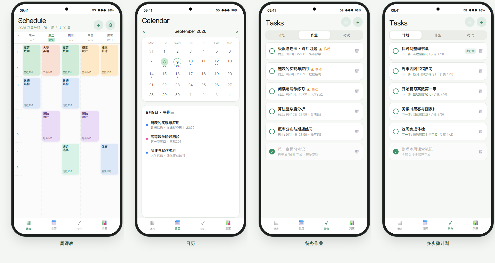
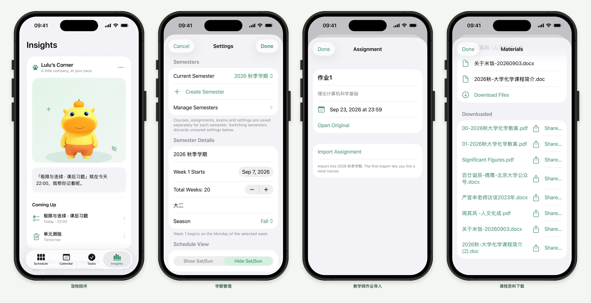
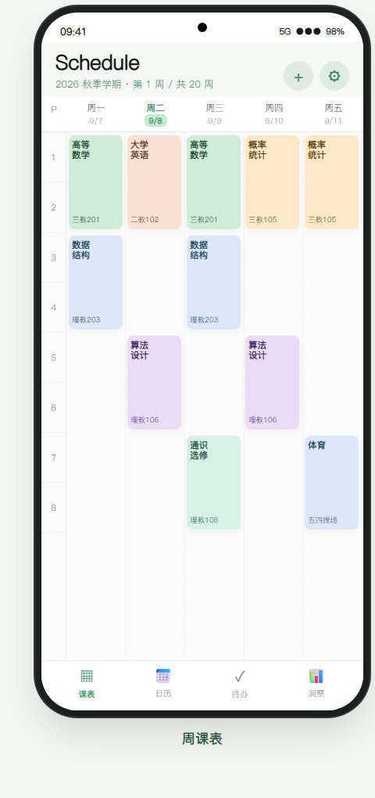
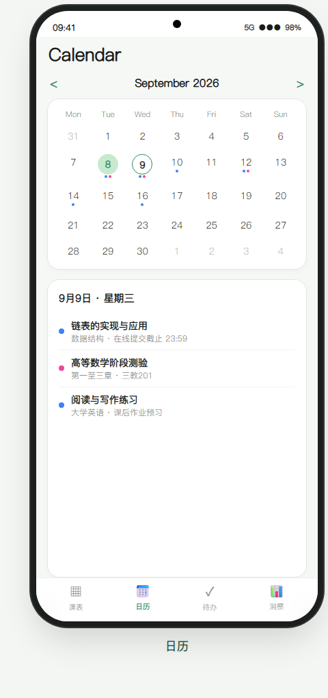
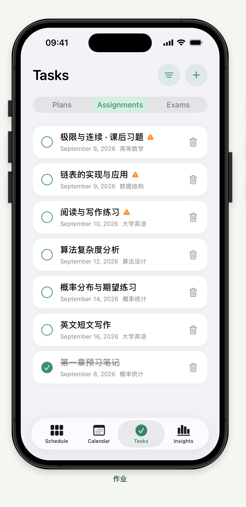
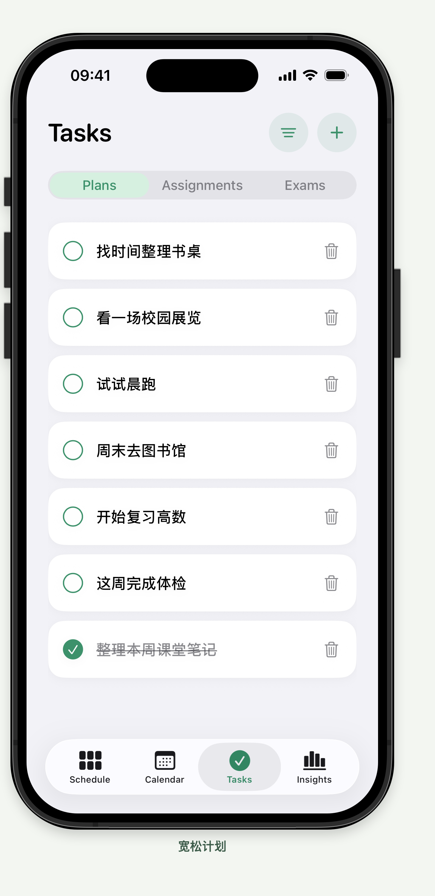
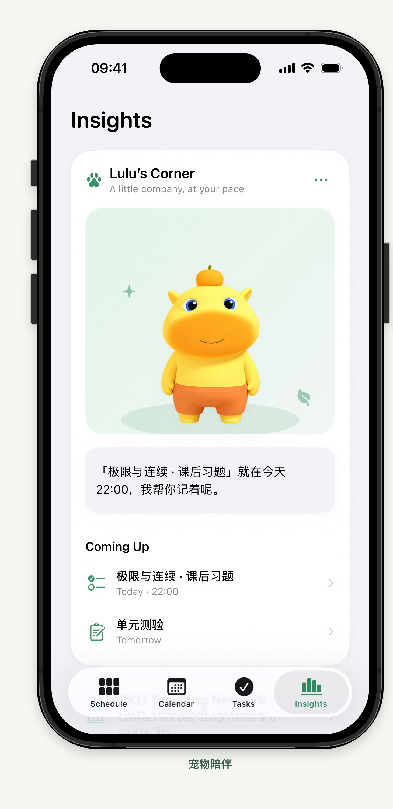
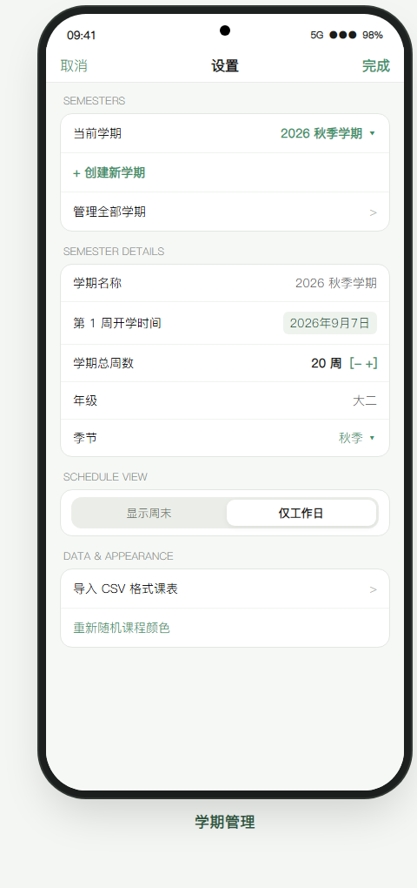
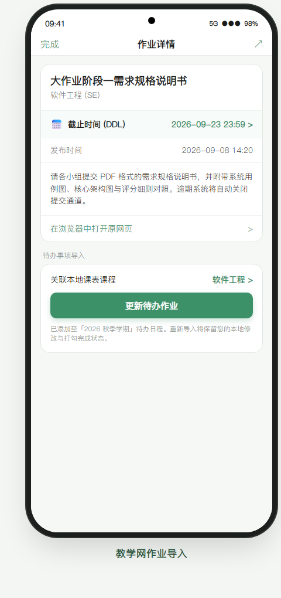
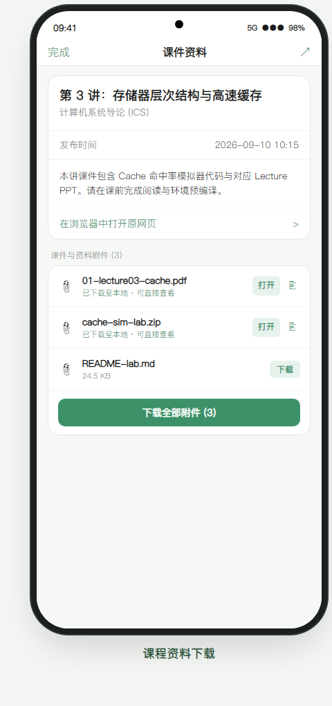

# 且行 (Schedule Android)

<div align="center">
  
  <h2>且行 · Schedule</h2>
  <p><b>简洁风北大日程待办管理应用</b></p>
  <p>创意（原版）源自 <a href="https://github.com/aidenlee2005/Schedule-Public">Schedule-Public</a>，针对 Android 15 深度优化。</p>

  <p>
    <a href="https://github.com/Fengyue-Yj/Schedule-Android/releases/latest"></a>
    
    
    
    
    <a href="LICENSE"></a>
  </p>

  <p>
    <a href="https://github.com/Fengyue-Yj/Schedule-Android/releases/latest"><b>📥 下载最新安装包 (APK)</b></a>
  </p>
</div>

---

## 📱 界面全景概览

<p align="center">
  
</p>
<p align="center">
  
</p>

---

## 🌟 核心功能特性

<table>
  <tr>
    <td width="50%" align="center">
      <a href="art/previews/01-schedule.png"></a>
      <br />
      <b>📅 周课表矩阵视图</b>
    </td>
    <td width="50%" align="center">
      <a href="art/previews/02-calendar.png"></a>
      <br />
      <b>📆 49 个月日历与日程清单</b>
    </td>
  </tr>
  <tr>
    <td align="left" valign="top">
      <ul>
        <li><b>1~12 节课矩阵</b>：支持多节连堂课程智能自适应合并排版。</li>
        <li><b>单/双/全周识别</b>：非本周课程自动隐退，当前周次课程清晰高亮。</li>
        <li><b>横向平滑周切</b>：左右滑动平滑切换 1..N 周，标示当前周数与今日高亮。</li>
        <li><b>周末视图切换</b>：支持 5 天制（纯工作日）与 7 天制（含周末）一键切换。</li>
        <li><b>批量课表导入</b>：原生支持标准 CSV 课表文件导入，智能识别中英文表头。</li>
      </ul>
    </td>
    <td align="left" valign="top">
      <ul>
        <li><b>49 个月超长跨度</b>：以当前月为轴心，前后跨越 49 个月超平滑流畅滑动。</li>
        <li><b>智能日程标记点</b>：
          <ul>
            <li>🔵 <b>蓝色圆点</b>：当日有作业截止提醒；</li>
            <li>🌸 <b>粉色圆点</b>：当日有考试日程。</li>
          </ul>
        </li>
        <li><b>当日日程联动</b>：点击任意日期，下方卡片即时呈现当天全部作业与考试详情。</li>
      </ul>
    </td>
  </tr>
  <tr>
    <td width="50%" align="center">
      <a href="art/previews/03-tasks-assignments.png"></a>
      <br />
      <b>✅ 待办作业与 DDL 预警</b>
    </td>
    <td width="50%" align="center">
      <a href="art/previews/04-tasks-plans.png"></a>
      <br />
      <b>🎯 宽松计划与多步骤分解</b>
    </td>
  </tr>
  <tr>
    <td align="left" valign="top">
      <ul>
        <li><b>智能截止排序</b>：按到期时间升序排列，未完成任务置顶，已完成自动归档。</li>
        <li><b>临近超期预警</b>：临近 3 天内截止任务高亮警示图标，避免遗漏 DDL。</li>
        <li><b>一键完成切换</b>：触控打勾圆钮，提供轻微阻尼触控反馈与完成划线。</li>
        <li><b>考试倒计时</b>：考试清单配有直观的 <code>D-N</code> 倒计时胶囊徽章。</li>
      </ul>
    </td>
    <td align="left" valign="top">
      <ul>
        <li><b>多步骤自主分解</b>：支持为计划自主添加任意数量的具体执行小步骤。</li>
        <li><b>步骤完成勾选</b>：清单式打勾管理，每一步均可随时打勾标记完成。</li>
        <li><b>下一步行动推荐</b>：自动将首个未完成的步骤同步为 Next Step，并在萌宠卡片中温馨提醒。</li>
        <li><b>轻量低压</b>：摆脱传统 Todo 的焦虑感，随心暂停、推进与恢复。</li>
      </ul>
    </td>
  </tr>
  <tr>
    <td width="50%" align="center">
      <a href="art/previews/05-insights-companion.png"></a>
      <br />
      <b>🌱 桌面萌宠 (Lulu / Nai) 与洞察</b>
    </td>
    <td width="50%" align="center">
      <a href="art/previews/06-settings.png"></a>
      <br />
      <b>⚙️ 学期沙盒管理与全局设置</b>
    </td>
  </tr>
  <tr>
    <td align="left" valign="top">
      <ul>
        <li><b>治愈拟态萌宠</b>：灵动细腻的微动画交互，陪伴学业日常，低内存开销。</li>
        <li><b>双角色随心切换</b>：可在温和的 <b>Lulu</b> 与灵动的 <b>Nai</b> 之间自由切换。</li>
        <li><b>轻触呼吸互动</b>：支持轻摸头部、挠挠肚子、长按小憩/唤醒，拥有丰富的微表情反馈。</li>
        <li><b>学业宏观看板</b>：卡片式统揽课程总数、作业完成进度与考试倒计时。</li>
      </ul>
    </td>
    <td align="left" valign="top">
      <ul>
        <li><b>多学期独立沙盒</b>：支持自由创建、编辑与切换多个学期，数据互不干扰。</li>
        <li><b>灵活校历参数</b>：自定义第 1 周开学日期、总周数、年级与季节。</li>
        <li><b>色彩个性化</b>：支持一键重新随机生成符合莫兰迪生机色板的课程主题色。</li>
        <li><b>本地数据安全</b>：全部核心数据持久化存储于手机本地 Room 数据库。</li>
      </ul>
    </td>
  </tr>
  <tr>
    <td width="50%" align="center">
      <a href="art/previews/07-teaching-assignment.png"></a>
      <br />
      <b>🎓 教学网作业详情与 DDL 联动</b>
    </td>
    <td width="50%" align="center">
      <a href="art/previews/08-teaching-materials.png"></a>
      <br />
      <b>📎 课件附件与资料下载管理</b>
    </td>
  </tr>
  <tr>
    <td align="left" valign="top">
      <ul>
        <li><b>官方统一认证</b>：直连北京大学统一身份认证（IAAA），仅本地保存 Cookie 会话。</li>
        <li><b>三大分类解析</b>：完整支持「成绩公布」、「作业任务」与「课件资料」解析。</li>
        <li><b>智能静默同步</b>：对齐 iOS 300 秒（5分钟）缓存 TTL，无感后台拉取。</li>
        <li><b>DDL 交互微调</b>：支持在作业详情中直接点击修改或补全截止时间（DDL）。</li>
        <li><b>关联本地课表</b>：一键将教学网作业同步导入到当前学期日程待办中。</li>
      </ul>
    </td>
    <td align="left" valign="top">
      <ul>
        <li><b>文件类型完整支持</b>：PDF、Word、PPT、代码包等常见课件格式。</li>
        <li><b>一键批量下载</b>：右上角快捷菜单或卡片底部一键下载当前课程全部课件附件。</li>
        <li><b>系统应用直达</b>：本地已下载文件一键调用系统应用直接预览打开，支持系统级一键分享。</li>
        <li><b>下载状态管理</b>：实时进度指示与状态缓存，避免重复下载。</li>
      </ul>
    </td>
  </tr>
</table>

---

## 🎨 纯正 iOS 质感美学与现代 Android 技术

- **苹方 (PingFang SC) 官方字库**：全局内置完整的 Apple 苹方标准字体族（`pingfang_sc.ttf`），中英文排版体验优雅纯正。
- **iOS 触控下凹反馈 (`iosPressable`)**：告别 Android 原生突兀的矩形水波纹，复刻 iOS 触控微缩放（0.98x）与柔和透明度变化。
- **绿意调色盘**：
  - 主强调色：`AccentLight = #3D9169` / `AccentDark = #6EBD94`
  - 高亮柔和色：`Highlight = #C7EACF` / 深森林绿：`DeepGreen = #298A5C`
- **Android 15 Edge-to-Edge**：边到边沉浸式全屏布局，状态栏与底部导航栏透明融合。

---

## 🛠️ 技术架构

```
com.schedule.app
├── data                    # 数据持久层 (Room 数据库、DAO、Entity、Converters)
│   ├── dao                 # CourseDao, AssignmentDao, FlexiblePlanDao, SettingDao ...
│   └── models              # CourseEntity, AssignmentEntity, FlexiblePlanEntity, PlanStepEntity ...
├── teaching                # 北大教学网核心协议模块
│   ├── TeachingSession.kt  # 统一网络会话与 Cookie 管理
│   ├── TeachingParser.kt   # Jsoup 高性能 DOM 与 API 解析引擎
│   ├── TeachingStore.kt    # 全局响应式状态仓库 (StateFlow)
│   ├── TeachingImporter.kt # 作业导入与本地课表智能模糊匹配
│   └── TeachingDownloader.kt# 后台多线程文件下载管理器
├── ui                      # 呈现层 (Jetpack Compose)
│   ├── components          # iOS 质感通用组件 (IosFormSection, IosModalBottomSheet, CardSurface...)
│   ├── schedule            # 课表矩阵视图、网格布局与加课表单
│   ├── calendar            # 49 个月日历矩阵与当日议程
│   ├── tasks               # 作业待办、考试倒计时与多步骤计划清单
│   ├── insights            # 治愈萌宠、对话系统与学业数据洞察看板
│   ├── teaching            # 教学网 Hub、课程筛选 Sheet、详情 Sheet 与 WebView 登录
│   └── theme               # 苹方字系、配色体系与动态明暗模式
└── util                    # 工具链 (CSV 解析器、日历周期计算器、时间格式化器)
```

---

## 📥 安装与体验

您可以前往本仓库的 **[Releases 页面](https://github.com/Fengyue-Yj/Schedule-Android/releases)** 下载最新版预编译 APK 安装包。

- **最新正式版本**：`v1.0.15`
- **安装包文件名**：`且行_v1.0.15.apk`
- **系统要求**：Android 8.0 (API 26) 及以上，完美适配 Android 14 / Android 15。

---

## 🏗️ 本地构建指引

1. 克隆本项目：
   ```bash
   git clone https://github.com/Fengyue-Yj/Schedule-Android.git
   cd Schedule-Android
   ```
2. 使用 **Android Studio Iguana / Jellyfish** 或更高版本打开项目目录。
3. 确保本地安装有 JDK 17 或以上版本（推荐 JDK 17 或 21）。
4. 在终端中直接运行 Gradle 任务进行构建：
   ```bash
   # Windows PowerShell
   .\gradlew.bat assembleDebug

   # macOS / Linux
   ./gradlew assembleDebug
   ```
5. 生成的安装包位于 `app/build/outputs/apk/debug/app-debug.apk`。

---

## 📄 开源许可与致谢

- 本项目采用 **[MIT License](LICENSE)** 开源协议。
- 原版 iOS 项目：感谢 [@aidenlee2005](https://github.com/aidenlee2005) 创作的优秀开源项目 [Schedule-Public](https://github.com/aidenlee2005/Schedule-Public)。
- 字体版权：PingFang SC 字体版权归 Apple Inc. 所有，仅限学习与交流使用。
